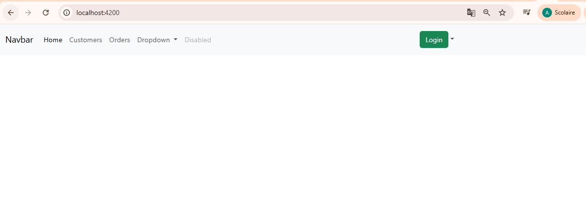
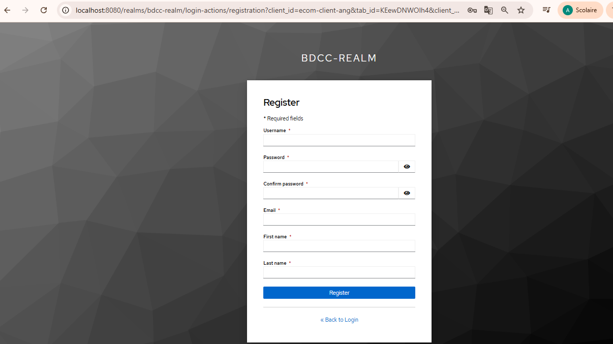
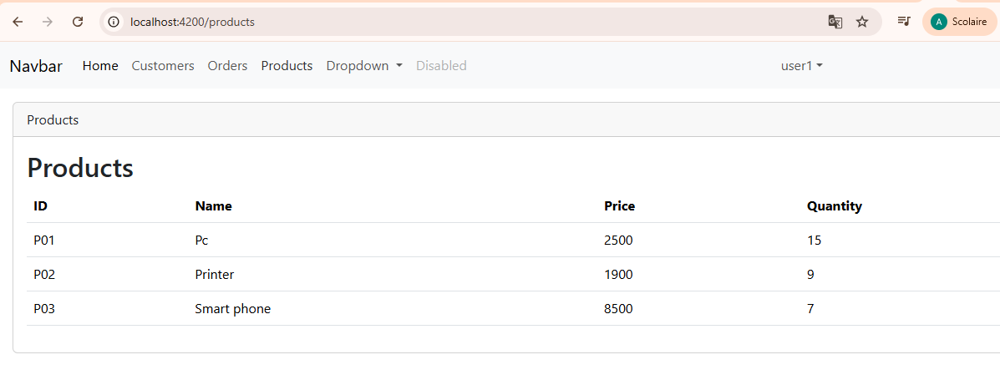
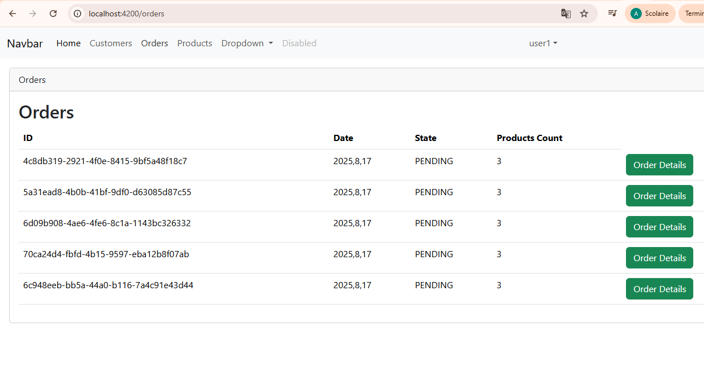

#  Projet Microservices E-commerce (TP)

## Description
Ce projet est un TP académique basé sur une architecture microservices avec **Spring Boot** et **Angular**.

### Objectifs :
- Sécuriser le **backend** et le **frontend** avec **Spring Security, OAuth2, OIDC, JWT et Keycloak**.
- Assurer la **communication entre microservices** via **OpenFeign** (exemple : récupération des produits depuis `inventory-service` dans `order-service`).

---

## Architecture du Système

### Vue globale
1. **Frontend** : Angular + Bootstrap, protégé par Keycloak.
2. **Backend** :
    - `Inventory Service` : gestion des produits (CRUD).
    - `Order Service` : gestion des commandes.
    - Communication sécurisée entre microservices via OpenFeign.
3. **Authentification & Autorisation** : Keycloak + JWT.

---

## Fonctionnement
- L’utilisateur se connecte via **Keycloak** → obtient un **token JWT**.
- Le **frontend Angular** envoie ce token au **backend**.
- Le **backend** valide le token avec **Keycloak**.
- `order-service` appelle `inventory-service` via **OpenFeign**, en propageant le **JWT**.

---

## Captures d’écran

### Authentification via Keycloak

### Liste des Produits

### Gestion des Commandes

---

## Conclusion
Ce projet a permis de mettre en pratique les concepts essentiels des **architectures microservices** en intégrant :
- La **sécurisation** du backend et du frontend (Spring Security, OAuth2, OIDC, JWT, Keycloak).
- La **communication inter-services** via OpenFeign.
- La mise en place d’un **frontend Angular sécurisé**.
 
